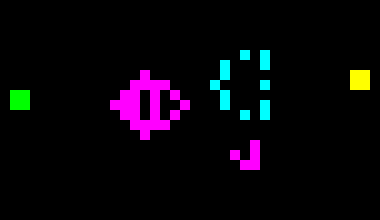
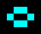
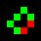
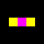
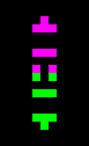
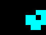
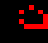
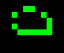
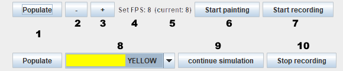

# Game of Life

------------------

This is a multicolored variant of Conway's Game of Life, a cellular automaton, which shows that simple algorithms can result in complex outcomes. It is programmed in Java and uses Swing for the frontend.

Traditionally, it is a zero-player game where the future for each cell gets decided by the amount of its neighbors. Each cell can have the state "dead" or "live". In this variant, five colors additionally represent five different live cell types.
The original rules of the game can be broken down to three rules:
1. Live cells with two or three live neighbors survive
2. Dead cells with three live neighbors become live cells
3. All other cells die or stay dead

To add more types of live cells, the second rule gets expanded to the following:

2. Dead cells with three live neighbors become live cells. The most common color among these live neighbors determines the color of the new live cell. In case of a draw, chance decides.

In the following tables there are a few examples of what kind of different cell structures can be expected.

<table>
  <tr>
  <th>Stable</th>
  </tr>
  <tr>
    <td>Block</td>
    <td></td>
  </tr>
  <tr>
    <td>Beehive</td>
    <td></td>
  </tr>
  <tr>
    <td>Loaf</td>
    <td></td>
  </tr>
  <tr>
    <td>Boat</td>
    <td></td>
  </tr>
  <tr>
    <td>Tub</td>
    <td></td>
  </tr>
</table>

<table>
  <tr>
  <th>Oscillators</th>
  </tr>
  <tr>
    <td>Blinker</td>
    <td></td>
  </tr>
  <tr>
    <td>Toad</td>
    <td></td>
  </tr>
  <tr>
    <td>Beacon</td>
    <td></td>
  </tr>
  <tr>
    <td>Pulsar</td>
    <td></td>
  </tr>
  <tr>
    <td>Pentadecathlon</td>
    <td></td>
  </tr>
</table>

<table>
  <tr>
  <th>Spaceships</th>
  </tr>
  <tr>
    <td>Glider</td>
    <td></td>
  </tr>
  <tr>
    <td>Light-weight spaceship</td>
    <td></td>
  </tr>
  <tr>
    <td>Middle-weight spaceship</td>
    <td></td>
  </tr>
  <tr>
    <td>Heavy-weight spaceship</td>
    <td></td>
  </tr>
</table>

## The Interface

------------------

The top represents the interface in simulation mode, the bottom in paint mode. The Populate-Button and the Record-Button are present in both modes.

1. Randomly places some live cells
2. Decreases the displayed frames per second in simulation mode
3. Increases the displayed frames per second in simulation mode
4. Displays the set FPS for simulation mode
5. Displays the currently achieved FPS, may differ from the set FPS due performance reasons
6. Starts the painting mode, where the user can place cells while the simulation is paused
7. saves the displayed simulation as pictures in the "recorded" directory
8. the selected cell type in paint mode
9. stops the paint mode and starts the simulation
10. stops the recording

### You need at least Java SE 15 to run the jar

------------------

You can get the newest version here: https://www.oracle.com/java/technologies/downloads/